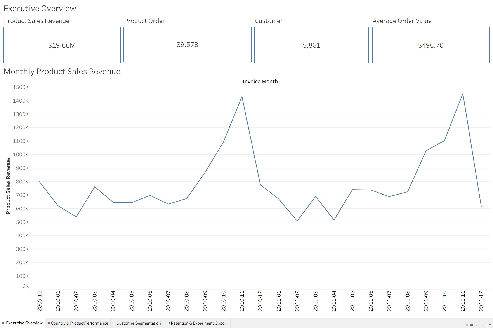
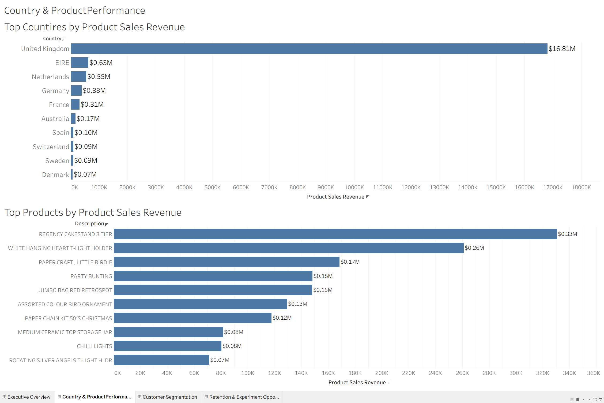
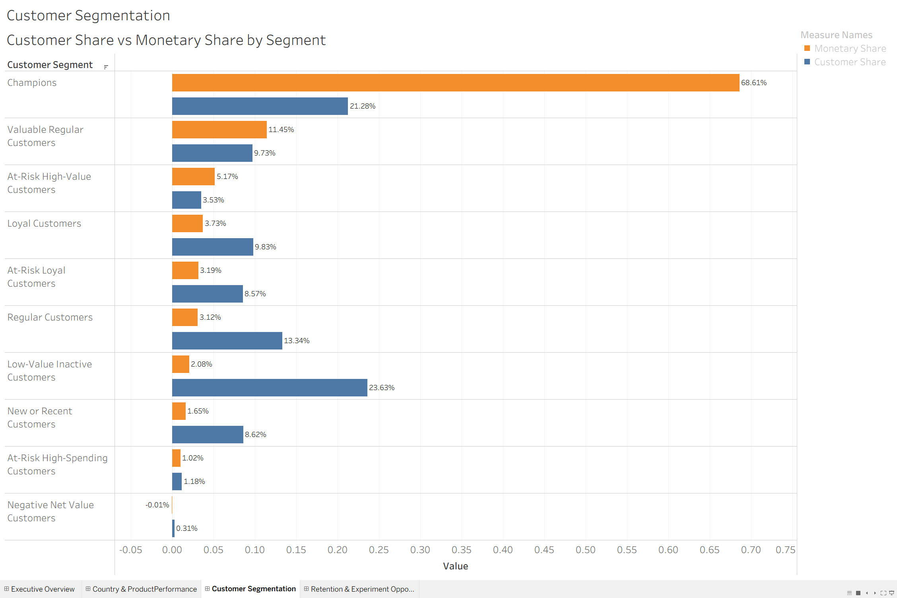
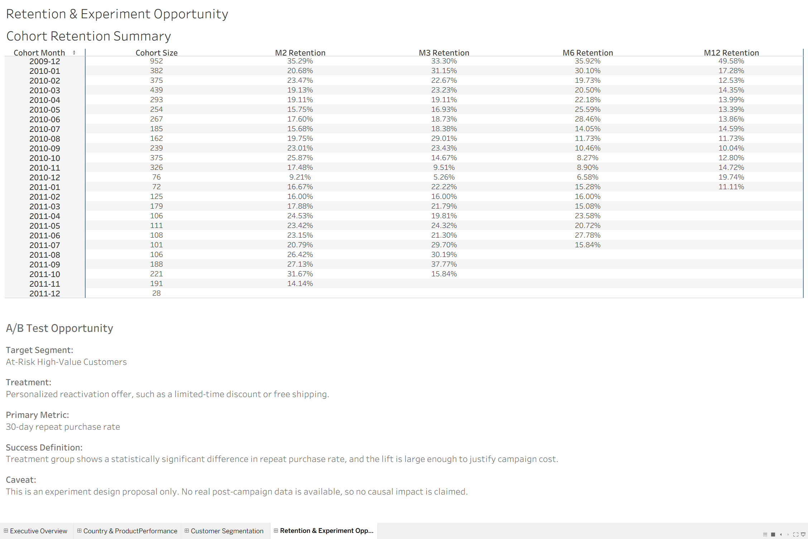

# AI-Assisted Retail Customer Analytics with Multi-Agent Workflow

## Project Overview

This project analyzes an online retail transaction dataset to understand sales performance, customer value, retention behavior, and potential reactivation opportunities.

The workflow combines Python-based data cleaning and analysis, SQL business metric validation, Tableau dashboarding, and AI-assisted review agents for code quality and business reasoning.

The final output is an interactive Tableau dashboard that summarizes business performance, country and product revenue, customer segmentation, cohort retention, and an A/B test design proposal.

## Tableau Dashboard

Interactive dashboard: [Retail Customer Analytics Dashboard](https://public.tableau.com/app/profile/xiao.zhang3191/viz/RetailCustomerAnalyticsDashboard_17829494676390/ExecutiveOverview?publish=yes)

## Dashboard Preview

### Executive Overview



### Country & Product Performance



### Customer Segmentation



### Retention & Experiment Opportunity



## Business Questions

This project focuses on the following business questions:

1. What is the overall sales performance of the retail business?
2. Which countries and products contribute the most revenue?
3. Which customer segments generate the most value?
4. How does customer retention change across monthly cohorts?
5. Which customer group is suitable for a reactivation experiment?

## Tools Used

- Python
- Pandas
- NumPy
- SQLite
- Jupyter Notebook
- Tableau Public
- Git / GitHub
- AI-assisted review agents (CodeX, Claude)

## Project Structure

```text
retail-customer-analytics/
│
├── agents/
│   ├── prompts/
│   └── outputs/
│
├── dashboard/
│   ├── executive_overview.png
│   ├── country_product_performance.png
│   ├── customer_segmentation.png
│   └── retention_experiment_opportunity.png
│
├── data/
│   ├── raw/
│   └── processed/
│
├── notebooks/
│   ├── 01_data_cleaning.ipynb
│   ├── 02_exploratory_analysis.ipynb
│   ├── 03_sql_business_metrics.ipynb
│   ├── 04_rfm_segmentation.ipynb
│   ├── 05_cohort_analysis.ipynb
│   └── 06_ab_test_design.ipynb
│
├── reports/
├── sql/
│   └── 01_business_metrics.sql
│
├── README.md
└── requirements.txt

Analysis Workflow
1. Data Cleaning

The raw transaction data was cleaned by standardizing column names, removing exact duplicates, handling missing descriptions, identifying cancelled invoices, separating price anomalies, and defining consistent revenue metrics.

Non-product transactions such as postage, manual adjustments, bank charges, Amazon fees, and bad debt adjustments were separated from product sales analysis.

2. Exploratory Data Analysis

The EDA module calculated overall business KPIs, monthly sales trends, country-level performance, product-level performance, and return/cancellation summaries.

Main dashboard metrics include product sales revenue, total product orders, total product customers, average order value, monthly revenue trends, top countries, and top products.

3. SQL Business Metrics

The SQL module translated the main product-sales metrics into reusable SQL queries using SQLite. This step validates that key reporting metrics can be reproduced outside of the Python EDA workflow.

4. RFM Customer Segmentation

Customers were segmented using RFM analysis:

Recency: how recently a customer purchased
Frequency: how often a customer purchased
Monetary value: customer-level net product revenue

The segmentation identifies high-value customers, loyal customers, inactive customers, and customers with negative net value.

5. Cohort Retention Analysis

Monthly customer cohorts were created based on each customer's first purchase month. Retention rates were calculated by tracking whether customers returned in later months.

The cohort analysis is used to understand repeat purchase behavior over time.

6. A/B Test Design

An experiment design was proposed for the At-Risk High-Value Customers segment. The treatment is a personalized reactivation offer, and the primary metric is 30-day repeat purchase rate.

This section is a design proposal only. No real post-campaign data is available, so no causal impact is claimed.

Key Findings
Product sales revenue reached approximately $19.66M.
The business had 39,573 product orders and 5,861 product customers.
The United Kingdom contributed the majority of product sales revenue.
A small group of high-value customers contributed a large share of total monetary value.
Champions represented a smaller share of customers but generated the majority of monetary value.
Cohort retention varied across months, and later cohorts had less observable time due to right-censoring.
At-Risk High-Value Customers were selected as the target group for a reactivation experiment.
Data Notes
Raw data is not included in this repository.
Product sales revenue excludes non-product transactions such as postage, manual adjustments, bank charges, Amazon fees, and bad debt adjustments.
Customer-level analysis excludes transactions without customer IDs.
RFM scores are relative to this dataset and should not be interpreted as fixed universal thresholds.
Cohort retention is monthly repeat purchase activity, not cumulative retention.
The A/B test section is an experiment design proposal, not an actual experiment result.
How to Run

Install dependencies:

pip install -r requirements.txt

Run notebooks in order:

01_data_cleaning.ipynb
02_exploratory_analysis.ipynb
03_sql_business_metrics.ipynb
04_rfm_segmentation.ipynb
05_cohort_analysis.ipynb
06_ab_test_design.ipynb

The cleaned and processed outputs are saved under:

data/processed/

The Tableau dashboard was created using the processed CSV outputs.

Author

Xiao Zhang